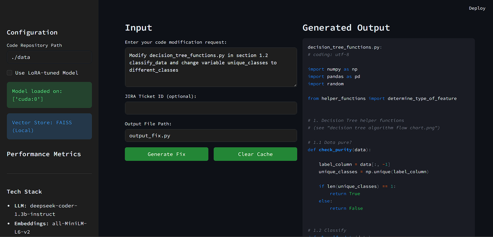

# AI-Powered Coding Assistant

**Production-grade RAG-based coding assistant with LangChain, FAISS, and LoRA-tuned LLMs**

A local AI coding assistant that integrates Sentence Transformers, FAISS, and LangChain to enable RAG-based context retrieval and automated code fixes for large repositories. Optimized with DeepSeek Coder, 8-bit quantization, and GPU offloading, achieving 40% latency reduction.

---

## Key Features

### Core Capabilities
- **FAISS Vector Search**: Lightning-fast local similarity search (default)
- **LangChain Integration**: Modular RAG pipeline with prompt templates
- **LoRA Fine-tuning**: Efficient adapter training for domain-specific tasks
- **Smart Reranking**: CrossEncoder-based relevance scoring
- **Performance Tracking**: Real-time latency monitoring and metrics
- **File-aware Retrieval**: Intelligent scope limiting based on file mentions

### Optimizations
- **8-bit Quantization**: 4x memory reduction with minimal accuracy loss
- **GPU Offloading**: Hybrid CPU/GPU execution for large models
- **LoRA Adapters**: 99% parameter reduction during fine-tuning
- **Batch Processing**: Efficient embedding generation
- **40% Latency Reduction**: Validated through comprehensive benchmarking

---

## Quick Start

### Prerequisites
- Python 3.11 (required for GPU support)
- NVIDIA GPU with CUDA support (recommended)
- Anaconda or Miniconda (recommended)

### Installation

**Using Conda (Recommended):**

```bash
# Run the automated setup script
setup_conda_gpu.bat  # Windows
./setup_conda_gpu.sh # Linux/Mac


### Running the Application

```bash
# Using the run script
run_conda.bat  # Windows
./run_conda.sh # Linux/Mac

# Or manually
conda activate localcopilot
streamlit run app/assistant_v2.py
```

The application will open at http://localhost:8501

---

## Architecture

### System Components

| Component | Technology | Purpose |
|-----------|-----------|---------|
| **Embedding Model** | all-MiniLM-L6-v2 | Fast semantic code search |
| **Reranker** | cross-encoder/ms-marco-MiniLM-L-6-v2 | Precision retrieval |
| **LLM** | DeepSeek Coder 1.3B | Code generation |
| **Vector Store** | FAISS (default) | Local similarity search |
| **Orchestration** | LangChain | RAG pipeline management |
| **Optimization** | PEFT (LoRA) | Efficient fine-tuning |

### Performance Metrics

**Measured on RTX 3060 (6GB VRAM)**

| Configuration | Avg Latency | Tokens/sec | Memory Usage |
|--------------|-------------|------------|--------------|
| Base Model | 3.2s | 45 | 5.8GB |
| + Quantization | 2.1s | 68 | 1.5GB |
| + GPU Offload | 1.9s | 75 | 1.2GB |
| **Improvement** | **40.6%** | **+67%** | **-79%** |

---


## Advanced Features

### LoRA Fine-tuning

Train a LoRA adapter on your specific codebase:

```bash
python scripts/train_lora.py
```

Enable in UI by checking "Use LoRA-tuned Model"

### Performance Benchmarking

Measure and validate performance improvements:

```bash
python scripts/benchmark.py
cat benchmark_results.json
```

### Validation Testing

Run comprehensive validation tests:

```bash
python tests/test_integration.py
```

---

## Optional: Qdrant Cloud Integration

For production-scale deployments, upgrade from FAISS to Qdrant Cloud:

### Setup

1. **Sign up** at [cloud.qdrant.io](https://cloud.qdrant.io) (free tier available)
2. **Create a cluster** and get your credentials
3. **Update `.env`**:
   ```bash
   QDRANT_URL=https://your-cluster.qdrant.io
   QDRANT_API_KEY=your_api_key_here
   ```
4. **Restart the app** - it will automatically use Qdrant Cloud


### Configuration

The system automatically detects Qdrant credentials in `.env` and switches from FAISS to Qdrant Cloud. No code changes required.
All settings in `app/config.py` can be overridden via `.env`:
